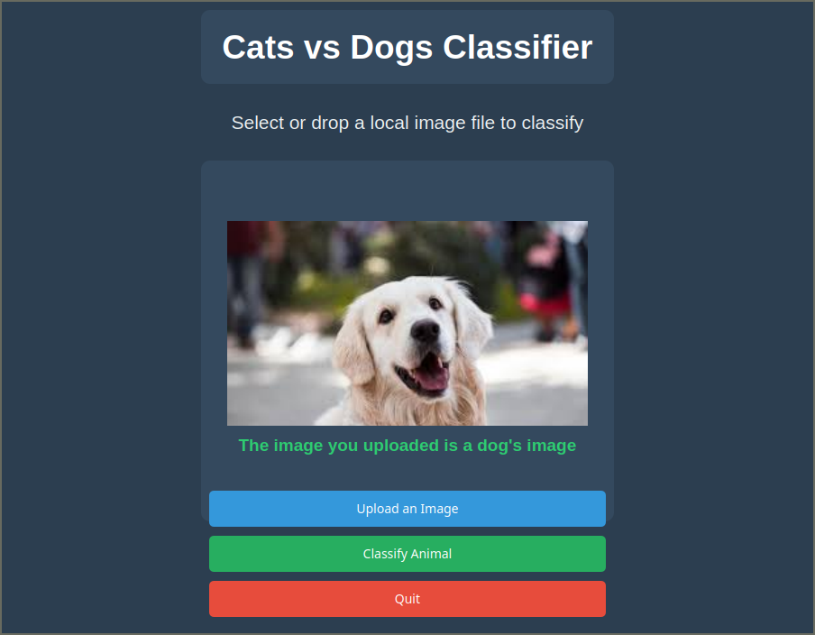

# CATS VS DOGS CLASSIFICATION WITH PYQT FRONTEND
## How to run
- Install the required dependencies through `python install -r requirements.txt`.
- Compile the model by running `python main.py`. Adjust the paths if necessary.
- View the front-end by running `python gui.py`. NOTE: You must compile the model first before running `gui.py`

## Demonstration

